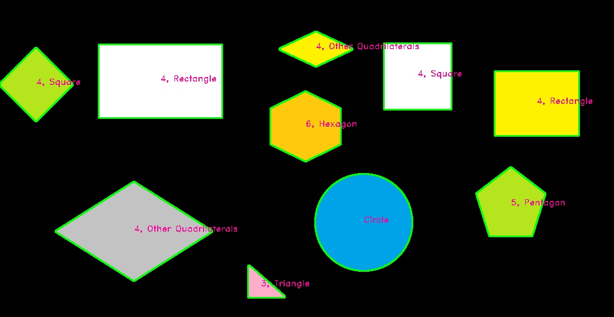
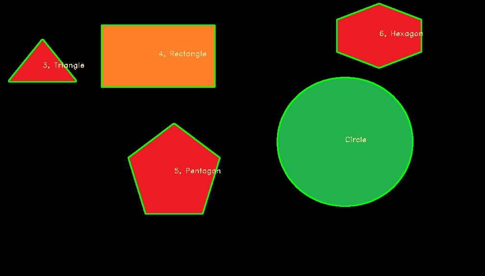

# Shape-Recognition
Shape recognition using Python, OpenCV
- A simple project using OpenCV open srouce to detect shapes in image
- Each type of shapes depends on the number of angles, we can find it by finding contours first.

 |  
